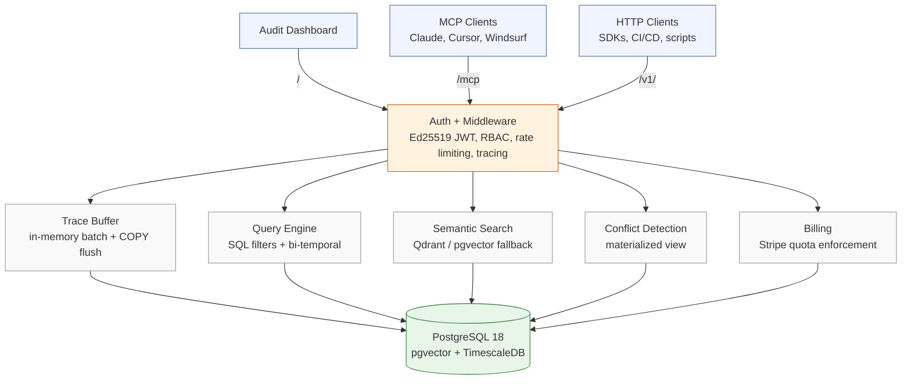

# Akashi

**Git blame for AI decisions.**

When multiple AI agents collaborate, their decisions are invisible. If something goes wrong, you can't answer: *who decided what, when, why, and what alternatives were considered?*

Akashi is the audit trail. Every agent decision gets recorded with its full reasoning chain, the alternatives that were weighed, the evidence that informed it, and the confidence level. When someone asks "why did the AI do that?", you have the answer.

## Quick start

```bash
# Start the local stack (Postgres + PgBouncer + Redis + Akashi)
docker compose -f docker/docker-compose.local.yml up -d

# Or build from source
make build
AKASHI_ADMIN_API_KEY=dev-admin-key ./bin/akashi

# Build with the embedded audit dashboard
make build-with-ui
AKASHI_ADMIN_API_KEY=dev-admin-key ./bin/akashi
# Open http://localhost:8080
```

### Record your first decision

```bash
TOKEN=$(curl -s -X POST http://localhost:8080/auth/token \
  -H 'Content-Type: application/json' \
  -d '{"agent_id": "admin", "api_key": "dev-admin-key"}' \
  | jq -r '.data.token')

curl -X POST http://localhost:8080/v1/trace \
  -H "Authorization: Bearer $TOKEN" \
  -H 'Content-Type: application/json' \
  -d '{
    "agent_id": "admin",
    "decision": {
      "decision_type": "model_selection",
      "outcome": "chose gpt-4o for summarization",
      "confidence": 0.92,
      "reasoning": "gpt-4o balances quality and cost for this task",
      "alternatives": [
        {"label": "gpt-4o", "selected": true, "score": 0.92},
        {"label": "claude-3-haiku", "selected": false, "score": 0.78}
      ],
      "evidence": [
        {"source_type": "benchmark", "content": "gpt-4o scored 94% on summarization eval"}
      ]
    }
  }'
```

### Search for similar decisions

```bash
curl -X POST http://localhost:8080/v1/search \
  -H "Authorization: Bearer $TOKEN" \
  -H 'Content-Type: application/json' \
  -d '{"query": "which model to use for text tasks", "limit": 5}'
```

## Three interfaces, one service

Akashi exposes the same capabilities through three interfaces. All share the same storage, auth, and embedding provider.

| Interface | Endpoint | Audience |
|-----------|----------|----------|
| **HTTP API** | `/v1/...` | Programmatic integrators, SDKs, CI/CD |
| **MCP server** | `/mcp` | AI agents in Claude, Cursor, Windsurf |
| **Audit dashboard** | `/` | Human reviewers, auditors, operators |

The MCP server provides five tools (`akashi_check`, `akashi_trace`, `akashi_query`, `akashi_search`, `akashi_recent`), three resources, and three prompts. Any MCP-compatible agent can connect with one line of config.

## What the audit trail captures

Every decision trace records:

- **The decision** -- what was chosen and the agent's confidence level
- **Reasoning** -- step-by-step logic explaining why
- **Rejected alternatives** -- what else was considered, with scores and rejection reasons
- **Supporting evidence** -- what information backed the decision, with provenance
- **Temporal context** -- when it was made, when it was valid (bi-temporal)
- **Conflicts** -- when two agents disagree on the same question

## SDKs

| Language | Path | Install |
|----------|------|---------|
| Go | [`sdk/go/`](sdk/go/) | `go get github.com/ashita-ai/akashi/sdk/go/akashi` |
| Python | [`sdk/python/`](sdk/python/) | `pip install akashi` |
| TypeScript | [`sdk/typescript/`](sdk/typescript/) | `npm install @akashi/sdk` |

All SDKs provide: `Check`, `Trace`, `Query`, `Search`, `Recent`. Auth token management is automatic.

## Architecture



## Documentation

| Document | Description |
|----------|-------------|
| [Configuration](docs/configuration.md) | All environment variables with defaults and descriptions |
| [Technical Deep Dive](docs/technical-deep-dive.md) | Architecture walkthrough, data model, code organization |
| [Runbook](docs/runbook.md) | Production operations: health checks, monitoring, troubleshooting |
| [Diagrams](docs/diagrams.md) | Mermaid diagrams of write path, read path, auth flow, schema |
| [ADRs](adrs/) | Architecture decision records (8 technical decisions) |
| [OpenAPI Spec](openapi.yaml) | Full API specification (also served at `GET /openapi.yaml`) |

## Testing

Tests use [testcontainers-go](https://golang.testcontainers.org/) for real TimescaleDB + pgvector instances. No mocks for the storage layer.

```bash
make test              # Full suite (requires Docker)
go test -race ./...    # Go tests with race detection
```

## Requirements

- Go 1.25+
- Docker (for testcontainers and local stack)

## License

Apache 2.0. See [LICENSE](LICENSE).
