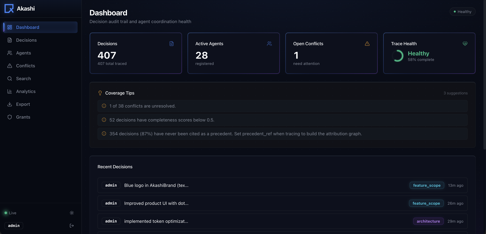
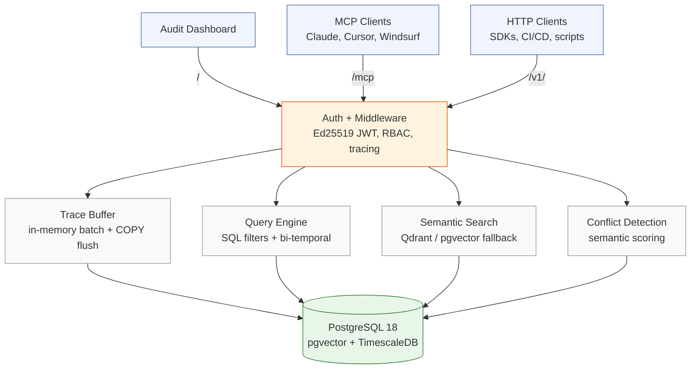

[](LICENSE)
[](https://go.dev/)
[](https://www.postgresql.org/)

**Version control for AI decisions.**

Multi-agent AI systems are moving from demos to production, but their decisions are invisible and uncoordinated. Agents contradict each other, relitigate settled work, and have no shared memory of what's already been decided. When something goes wrong, nobody can answer: *who decided what, when, why, and what alternatives were considered?*

Akashi is the decision coordination layer. Every agent checks for precedents before deciding and records its full reasoning after. When agents diverge on the same topic, Akashi detects it semantically — and when the CTO asks "why did the AI do that?" or an auditor asks for proof of decision traceability, you have the answer.



## How it works

Akashi is built around two primitives: **check before deciding, trace after deciding.**

```
Before making a decision          After making a decision
─────────────────────────         ───────────────────────
akashi_check                      akashi_trace
  "has anyone decided this?"        "here's what I decided and why"
  → precedents                      → stored permanently
  → known conflicts                 → embeddings computed
                                    → conflicts detected
```

When an agent calls `akashi_trace`, the decision is written atomically with its reasoning, alternatives, and evidence. Embeddings are computed, and conflict detection runs asynchronously — comparing the new decision against the org's history to find genuine contradictions between agents. Conflicts have a lifecycle (`open → resolved` or `false_positive`) and can declare a winner when resolved.

When an agent later observes whether a past decision was correct, `akashi_assess` feeds that outcome back into search re-ranking — so better decisions surface higher as precedents over time.

See [Subsystems](docs/subsystems.md) and [Conflict Detection](docs/conflicts.md) for internals.

---

## Quick start

Two modes are available today. A third (local-lite, zero-infrastructure) is in progress.

### Complete local stack (recommended)

> **Start here.** This is the fastest path to a fully working Akashi with all features.

Everything runs in Docker — TimescaleDB, Qdrant, Ollama, and the Akashi server. No API keys, no external accounts.

```bash
docker compose -f docker-compose.complete.yml up -d
```

**First launch builds the server image from source and downloads two Ollama models: `mxbai-embed-large` (~670MB) for embeddings and `qwen3.5:9b` (~6.6GB) for LLM conflict validation.** Expect 15–25 minutes on first run depending on your machine and network. Subsequent launches start in seconds.

Watch model download progress:

```bash
docker compose -f docker-compose.complete.yml logs -f ollama-init
```

The server is ready when you see a `listening` log line. Model downloads run in the background — embeddings and conflict validation activate automatically once complete.

```bash
curl http://localhost:8080/health
# Open http://localhost:8080 for the audit dashboard
```

If port 8080 is already in use, set `AKASHI_PORT` before starting:

```bash
echo "AKASHI_PORT=8081" > .env
docker compose -f docker-compose.complete.yml up -d
```

### Local-lite mode *(coming soon)*

> **Not yet available.** This mode is under active development — [track progress in issue #312](https://github.com/ashita-ai/akashi/issues/312).

A zero-dependency binary backed by SQLite. No Docker, no Postgres, no Qdrant, no Ollama.
All 6 MCP tools will work identically to the full server via stdio transport.
When it ships, individual developers can be up and running in under 3 seconds — no infrastructure required.

### Binary only (bring your own infrastructure)

Just the Akashi server container. You provide TimescaleDB, Qdrant, and an embedding API key.

```bash
cp docker/env.example .env
# Edit .env: set DATABASE_URL, AKASHI_ADMIN_API_KEY, and optionally QDRANT_URL / OPENAI_API_KEY
docker compose up -d
```

Required variables:

| Variable | Description |
|----------|-------------|
| `DATABASE_URL` | TimescaleDB connection string (pgvector + TimescaleDB extensions required) |
| `AKASHI_ADMIN_API_KEY` | Bootstrap API key for the admin agent |

Optional (server starts without them — search falls back to text):

| Variable | Description |
|----------|-------------|
| `QDRANT_URL` | Qdrant endpoint for vector search |
| `OPENAI_API_KEY` | Enables OpenAI embeddings and LLM conflict validation |
| `OLLAMA_URL` | Ollama endpoint for local embeddings |
| `AKASHI_JWT_PRIVATE_KEY` | Path to Ed25519 private key PEM file. **Empty = ephemeral key pair generated on every startup** — all tokens are invalidated on each restart. Set this for any persistent deployment. |
| `AKASHI_JWT_PUBLIC_KEY` | Path to Ed25519 public key PEM file. Must be set alongside the private key. |
| `AKASHI_JWT_EXPIRATION` | JWT token lifetime. Default: `24h`. |

See [Configuration](docs/configuration.md) for all variables and the [Self-Hosting Guide](docs/self-hosting.md) for full setup instructions.

See the [Self-Hosting Guide](docs/self-hosting.md) for step-by-step verification and the [FAQ](docs/faq.md) for curl examples covering auth, tracing, and searching.

## MCP integration

The fastest way to use Akashi is through MCP. Your agent gains decision tracing with zero code changes.

The MCP endpoint supports two auth schemes. **`ApiKey` is recommended for config files** — it never expires and survives server restarts:

| Scheme | Format | Expires? | Best for |
|--------|--------|----------|----------|
| `ApiKey` | `ApiKey <agent_id>:<api_key>` | Never | MCP config files |
| `Bearer` | `Bearer <jwt>` | 24h (default) | Programmatic / short-lived access |

Confirm the server is reachable before adding credentials to your config:

```bash
curl http://localhost:8080/mcp/info
```

### Claude Code

```bash
# Default API keys:
#   docker-compose.complete.yml → admin
#   docker-compose.yml (binary-only) → changeme
AKASHI_ADMIN_API_KEY="${AKASHI_ADMIN_API_KEY:-admin}"

# Add globally (all projects on this machine) — never expires
claude mcp add --transport http --scope user akashi http://localhost:8080/mcp \
  --header "Authorization: ApiKey admin:$AKASHI_ADMIN_API_KEY"

# Or scope to just the current project
claude mcp add --transport http --scope project akashi http://localhost:8080/mcp \
  --header "Authorization: ApiKey admin:$AKASHI_ADMIN_API_KEY"
```

### Cursor, Windsurf, and other MCP clients

Add to your MCP configuration file (`~/.cursor/mcp.json`, `~/.windsurf/mcp.json`, etc.):

```json
{
  "mcpServers": {
    "akashi": {
      "url": "http://localhost:8080/mcp",
      "headers": {
        "Authorization": "ApiKey admin:<your-api-key>"
      }
    }
  }
}
```

Replace `admin` with your agent ID and `<your-api-key>` with your `AKASHI_ADMIN_API_KEY` value.

For JWT-based auth instead, see [Self-Hosting Guide § Persistent JWT signing keys](docs/self-hosting.md).

### Available tools

| Tool | Purpose |
|------|---------|
| `akashi_check` | Look for precedents before making a decision (optional type filter; semantic query) |
| `akashi_trace` | Record a decision with reasoning and confidence |
| `akashi_assess` | Record whether a past decision turned out to be correct |
| `akashi_query` | Find decisions: structured filters (type, agent, confidence) or semantic search via `query` param |
| `akashi_conflicts` | List and filter open conflicts between agents |
| `akashi_stats` | Aggregate health metrics for the decision trail |

Three prompts guide the workflow: `agent-setup` (system prompt with the check-before/record-after pattern), `before-decision` (precedent lookup guidance), and `after-decision` (recording reminder).

### What this looks like in practice

A planner agent decides to use microservices for a payment system and records it via `akashi_trace`. Later, a coder agent is about to choose a monolith for the same system. It calls `akashi_check` first and discovers the planner already made a conflicting decision with different reasoning. The coder sees the conflict, reviews the planner's evidence, and either aligns or records a competing decision with its own rationale. Either way, the disagreement is visible and auditable.

## Three interfaces, one service

| Interface | Endpoint | Audience |
|-----------|----------|----------|
| **HTTP API** | `/v1/...` | Programmatic integrators, SDKs, CI/CD |
| **MCP server** | `/mcp` | AI agents in Claude, Cursor, Windsurf |
| **Audit dashboard** | `/` | Human reviewers, auditors, operators |

All three share the same storage, auth, and embedding provider.

## SDKs

| Language | Path | Install |
|----------|------|---------|
| Go | [`sdk/go/`](sdk/go/) | `go get github.com/ashita-ai/akashi/sdk/go/akashi` |
| Python | [`sdk/python/`](sdk/python/) | `pip install git+https://github.com/ashita-ai/akashi.git#subdirectory=sdk/python` |
| TypeScript | [`sdk/typescript/`](sdk/typescript/) | `npm install github:ashita-ai/akashi#path:sdk/typescript` |

All SDKs provide: `Check`, `Trace`, `Query`, `Search`, `Recent`. Auth token management is automatic.

## Architecture


```mermaid
flowchart TD
    C1["Audit Dashboard"] -->|"/"| AUTH
    C2["MCP Clients<br/>Claude, Cursor, Windsurf"] -->|"/mcp"| AUTH
    C3["HTTP Clients<br/>SDKs, CI/CD, scripts"] -->|"/v1/"| AUTH

    AUTH["Auth + Middleware<br/>Ed25519 JWT, RBAC, tracing"]

    AUTH --> TRACE["Trace Buffer<br/>in-memory batch + COPY flush"]
    AUTH --> QUERY["Query Engine<br/>SQL filters + bi-temporal"]
    AUTH --> SEARCH["Semantic Search<br/>Qdrant / pgvector fallback"]
    AUTH --> CONFLICT["Conflict Detection<br/>semantic scoring"]

    TRACE --> PG
    QUERY --> PG
    SEARCH --> PG
    CONFLICT --> PG

    PG[("PostgreSQL 18<br/>pgvector + TimescaleDB")]

    style C1 fill:#f0f4ff,stroke:#4a6fa5
    style C2 fill:#f0f4ff,stroke:#4a6fa5
    style C3 fill:#f0f4ff,stroke:#4a6fa5
    style AUTH fill:#fff3e0,stroke:#e65100
    style TRACE fill:#f9f9f9,stroke:#999
    style QUERY fill:#f9f9f9,stroke:#999
    style SEARCH fill:#f9f9f9,stroke:#999
    style CONFLICT fill:#f9f9f9,stroke:#999
    style PG fill:#e8f5e9,stroke:#2e7d32
```

## Documentation

| Document | Description |
|----------|-------------|
| [FAQ](docs/faq.md) | Common questions about setup, concepts, auth, integrity, SDKs, and architecture |
| [Self-Hosting Guide](docs/self-hosting.md) | Step-by-step deployment: Postgres-only through full stack with Qdrant and Ollama |
| [Configuration](docs/configuration.md) | All environment variables with defaults and descriptions |
| [Conflict Detection](docs/conflicts.md) | How conflicts are found, scored, validated, and resolved |
| [GDPR Erasure](docs/erasure.md) | Tombstone erasure for right-to-be-forgotten compliance |
| [Quality Scoring](docs/quality-scoring.md) | Completeness scores, outcome scores, and anti-gaming measures |
| [IDE Hooks](docs/hooks.md) | Claude Code and Cursor integration via hook endpoints |
| [Subsystems](docs/subsystems.md) | Embedding provider, rate limiting, and Qdrant search pipeline internals |
| [Runbook](docs/runbook.md) | Production operations: health checks, monitoring, troubleshooting |
| [Diagrams](docs/diagrams.md) | Mermaid diagrams of write path, read path, auth flow, schema |
| [ADRs](adrs/) | Architecture decision records (10 technical decisions) |
| [OpenAPI Spec](api/openapi.yaml) | Full API specification (also served at `GET /openapi.yaml`) |

## Building from source

```bash
make build           # without UI
make build-with-ui   # with embedded audit dashboard
```

The binary requires PostgreSQL 18 with the `pgvector` and `timescaledb` extensions. See the [Self-Hosting Guide](docs/self-hosting.md) for full setup instructions, including local database options for development.

## Testing

Tests use [testcontainers-go](https://golang.testcontainers.org/) for real TimescaleDB + pgvector instances. No mocks for the storage layer.

```bash
make test              # Full suite (requires Docker)
go test -race ./...    # Go tests with race detection
```

## IDE hooks (optional)

Akashi can enforce the check-before/trace-after workflow automatically in Claude Code and Cursor via IDE hooks. Run `make install-hooks` to set up. See [IDE Hooks](docs/hooks.md) for details.

## Requirements

- Go 1.26+
- Docker (for testcontainers and local stack)

## License

Apache 2.0. See [LICENSE](LICENSE).
