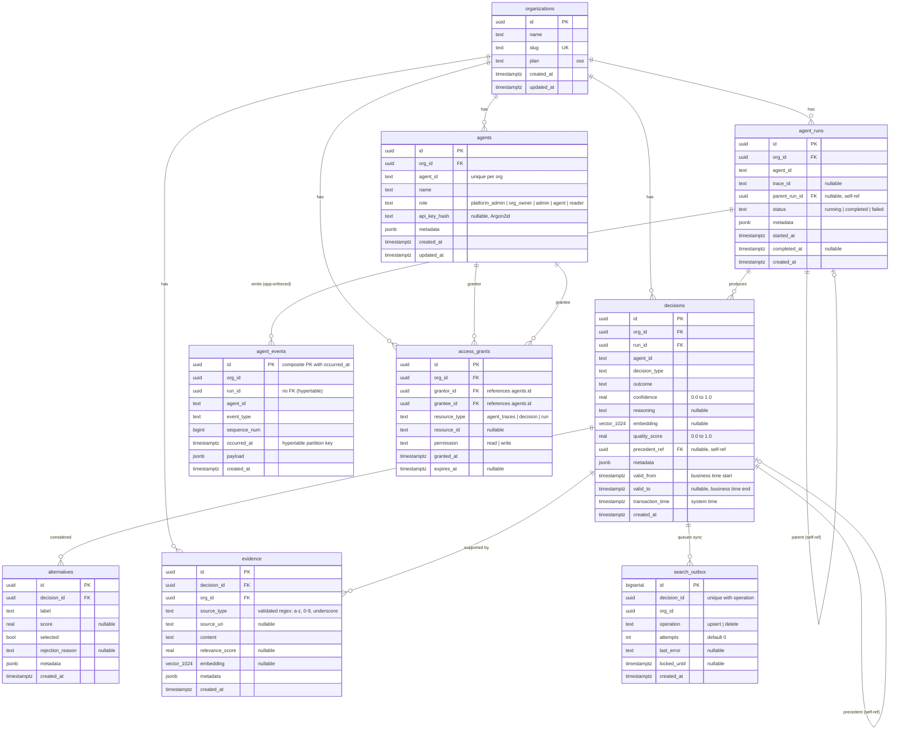

# Akashi System Diagrams

Mermaid diagrams documenting the core data flows, authentication model, and schema
of the Akashi decision trace layer. These render natively on GitHub.

---

## 1. Write Path (Trace Ingestion)

A client records a decision by posting to `/v1/trace`. The request passes through
the middleware chain (request ID, security headers, CORS, tracing, logging, JWT
auth, panic recovery), then through `requireRole(agent)` authorization before
reaching the handler. The handler delegates to the shared `decisions.Service`,
which orchestrates embedding generation, quality scoring, and
an atomic transactional write. Notification happens after the
transaction commits and is non-fatal on failure.

---

## 2. Read Path

Three query endpoints serve different access patterns. All three enforce org-scoped
data isolation via `org_id` WHERE clauses and apply role-based access filtering
after the query returns: admins see all decisions within their org, agents see
their own decisions plus those covered by access grants.

---

## 3. Outbox Sync (Qdrant)

The search outbox guarantees at-least-once delivery of decision embeddings to
Qdrant. The outbox row is inserted inside the same transaction that writes the
decision, so the two are atomically consistent. A background worker polls the
outbox on a configurable interval, processes entries in batches using
`SELECT ... FOR UPDATE SKIP LOCKED` for concurrency safety, and uses exponential
backoff on failure. Entries that exceed 10 attempts are logged as dead letters
and cleaned up after 7 days.

---

## 4. Authentication Flow

Two authentication paths serve different use cases. **Path A** exchanges long-lived
API key credentials for a short-lived JWT. The server iterates over all agents
matching the `agent_id` (which is unique per org, not globally) and uses
timing-safe Argon2id comparison. A dummy verify runs when no hash is found to
prevent timing side-channels. **Path B** validates the JWT on every API request
via the `authMiddleware`, which checks the Ed25519 signature, expiry, issuer
(`akashi`), and subject (must be a valid UUID).

---

## 5. SSE Subscription Lifecycle

Real-time notifications are delivered via Server-Sent Events. The Broker listens
on a dedicated PostgreSQL connection (direct, not through PgBouncer) for
`LISTEN/NOTIFY` messages. Subscribers are org-scoped: a notification's `org_id`
payload field determines which subscribers receive it. Slow subscribers with full
buffers are skipped to prevent one client from blocking others. The notify
connection has automatic reconnect with exponential backoff, and tracked channels
are re-subscribed after reconnection.

---

## 6. Entity Relationship Diagram

The schema is organized around organizations as the top-level tenant boundary.
Every tenant-scoped table carries an `org_id` foreign key. Decisions use
bi-temporal modeling (`valid_from`/`valid_to` for business time,
`transaction_time` for system time). The `search_outbox` table drives
asynchronous sync to Qdrant. The `agent_events` table is a TimescaleDB
hypertable partitioned by `occurred_at`, which does not support foreign keys.
The `alternatives` table tracks the options considered for each decision, and
the `evidence` table records supporting information with provenance tracking.

